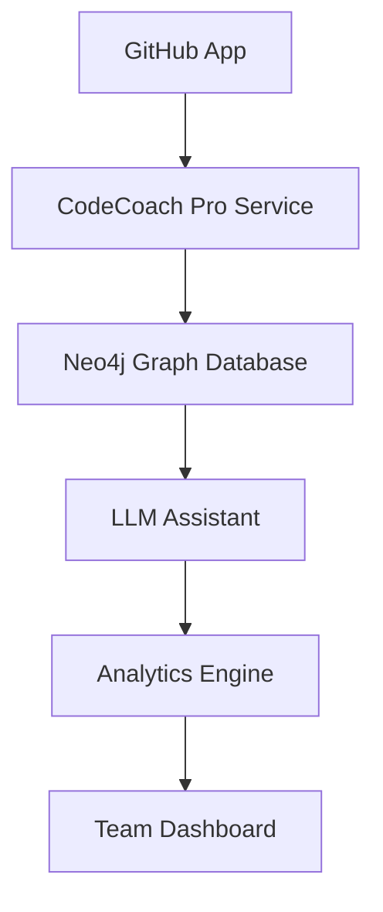

# CodeCoach Documentation

Welcome to **CodeCoach Pro**, your comprehensive guide for architecture decisions, style rules, best practices, and team workflows. This enhanced version serves as your "single source of truth" for all project documentation.

---

## 1. Project Overview  
**CodeCoach Pro** is an enterprise-grade documentation service that:
- 🧠 Ingests structured documentation into a Neo4j graph  
- 💬 Powers advanced LLM-backed Q&A on architecture, style, and workflows  
- 🔄 Supports real-time updates via "episodes"
- 🔍 Provides semantic search across all documentation
- 📊 Generates documentation analytics and insights
- 🤝 Facilitates team collaboration through shared knowledge

---

## 2. Architecture Overview  


- **Ingest Service**: Built on Python 3.10+, leverages Langchain for advanced chunking + entity extraction
- **Neo4j Database**: Enterprise-grade graph storage with:
  - Automated backups
  - High availability clustering
  - Real-time replication
- **AI Assistant**: Uses GPT-4 with RAG for context-aware responses
- **Analytics**: Tracks documentation health and usage patterns

---

## 3. Project Structure  
/
├── src/
│ ├── ingest/
│ │ ├── init.py
│ │ ├── processor.py
│ │ └── validator.py
│ ├── api/
│ │ ├── init.py
│ │ └── routes.py
│ └── utils/
│ ├── init.py
│ └── helpers.py
├── tests/
│ ├── test_ingest.py
│ └── test_api.py
├── docs/
│ └── codecoach.md
├── pyproject.toml
└── README.md


---

## 4. Development Standards  

### Python Standards
- Use **RED** for formatting (100-char line length)
- Strict type hints with `pyright` validation
- 100% test coverage requirement
- Docstring format: Google style

### Documentation Standards
- All modules must have documentation
- API endpoints require OpenAPI specs
- Markdown files:
  - Use ATX headings
  - No line length restrictions
  - Include table of contents

### Git Workflow
- Branch naming: `type/description`
  - Types: `feature`, `bugfix`, `hotfix`, `docs`
- Commits must be signed
- PRs require:
  - 2 approvals
  - Passing CI/CD
  - No security vulnerabilities

---

## 5. Deployment Process

1. **Development**
   ```bash
   poetry install
   poetry run pre-commit install
   ```

2. **Testing**
   ```bash
   poetry run pytest --cov
   poetry run pyright
   ```

3. **Deployment**
   ```bash
   docker compose up -d
   ```

---

## 6. Security Guidelines

- All secrets in HashiCorp Vault
- Regular dependency audits
- SAST scanning in CI/CD
- Monthly security reviews

---

## 7. Monitoring & Analytics

- Prometheus metrics
- Grafana dashboards
- Daily health checks
- Weekly usage reports

---

## 8. Team Workflows

### Documentation Updates
1. Create feature branch
2. Update relevant docs
3. Run validation:
   ```bash
   poetry run python -m src.ingest.validator
   ```
4. Submit PR for review

### Code Reviews
- Maximum 200 lines per review
- 48-hour SLA for initial review
- Use conventional comments
